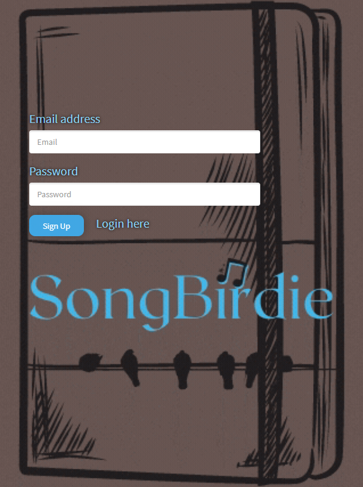
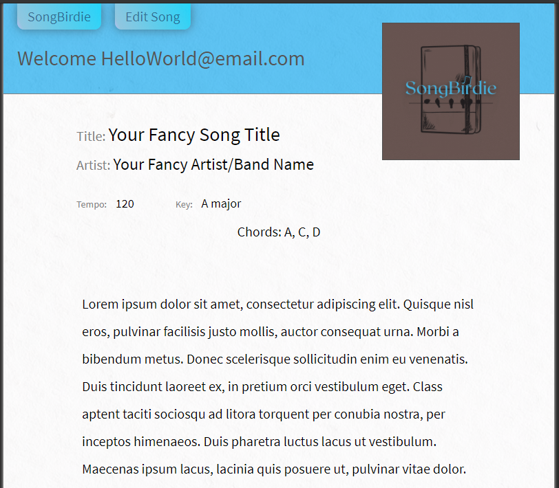

## <a id='back-to-top' > </a>
# SongBirdie™️ 🎶     </br> [](https://www.gnu.org/licenses/gpl-3.0)

<p>
    
    
    
    
</p>
<p>
    <a href="https://github.com/Bryson-Palmer">
        
    </a>
</p>

Your mobile compendium of songs, lyrics, chords, and other helpful musical information. We created SongBirdie as a way for a modern singer/songwriter to compile their own personal journal. Utilizing SongBirdie allows you to have a digital SongBook wherever you are connected to the internet. We also know your SongBook is a personal item, so when you create an account, only you can view your song information. At SongBirdie you are free to be you - with the flexibility to save your creative inspirations wherever you may be. Perhaps it's a song name, a new lyric, a new set of chords to try - add what you want when you want. There are so many relationships in music - and with the ability to view, add, edit, and delete a song - the options are limitless.

## Table of Contents
  [How to Use Our Site](#how-to) </br>
  [Technologies](#technologies) </br>
  [Links and Screenshots](#links) </br>
  [Future Development](#future-development) </br>
  [SongBirdie Team](#team) </br>
  [Questions](#questions) </br>
  [License](#license) </br>

## <a id='how-to'></a> How to Use Our Site 📃
When you visit our site - http://song-birdie.herokuapp.com/ - you will be prompeted to sign up or login. If you are new to the site, or you want to create another account, just type in an email and a password and click the sign in button. If you have visited before, click the login text below the form to be taken to the login page, where you can enter your credintals. When you have successfully created an account or signed in, you will be taken to your homepage - your **SongBirdie** song book, here we provide a list of all of your saved songs. When you are on your home page, you will have the option to click on any of your songs to view their full information. At the top of the page is the `SongBirdie` tab with links and a search field. The links will take you to your home page, add to song book, or logout.

To access the `search` capabilities simply type into the input field from your home page. As you type, your search will filter your songs in real time. This search area will filter from both your saved song titles and artist names. When you are done, simply click on the link to the song you want or clear the search field to bring back an unfiltered page.

By clicking the `Add To Song Book` link, you will be prompted to add a song title, artist name, key, tempo, chords, and lyrics. You must enter a song *title* and *artist* name for the song to save to your **SongBirdie** song book. The *tempo/bpm* is also limited to a number between 60 and 200. The other fields are not required to save a song to your song book, and can be updated at any time.  

If you click on a song title on your home page, you will be taken to that song page - here you will see the full version of your saved song (song title, artist name, key, tempo, chords, and lyrics). Within this page, you will see the `Edit Song` tab at the top next to the `SongBirdie` tab - you now have the ability to edit or delete your song. On the edits page - all of your current song information will be displayed. You can make any changes you like and click the `Update` button to save the new version to your song book. Deleting your song will remove it permanantly from your song book. So be careful.

## <a id='technologies'></a> Technologies Utilized 💻
<p>
  
  
  
  
  
   </br>
  
  
  
  
  
  
  
</p>

During development our team utilized [Travis CI](https://docs.travis-ci.com/user/for-beginners/) to test build our code before merging to our repository, and [prettier](https://prettier.io/docs/en/) to help format our code. SongBirdie utilizes [jQuery](https://api.jquery.com/), [handlebars](https://handlebarsjs.com/), and [sequelize](https://sequelize.org/master/index.html), while adhering to the MVC (model, view, controller) design model.  To handle passwords, we utilized [passportjs](http://www.passportjs.org/docs/) and [bcryptjs](https://www.npmjs.com/package/bcryptjs) to authenticate and hash each users password.  [Express-session](https://www.npmjs.com/package/express-session) handles session authentication, ensuring the user is correctly logged in while navigating the site.

## <a id='links'></a> Links and Screenshots  📷
[SongBirdie Github Repository](https://github.com/Bryson-Palmer/song-bird)

[SongBirdie app](http://song-birdie.herokuapp.com/)

**Login and Signup**
 </br> </br>
**Song Page Layout**
 </br>

## <a id='future-development'></a> Future Development 🔍 
There are several features we would love to get in the **SongBirdie** app in the future.

* The ability to search for other artist's song information via a third party api. You could then bring in the song title, artist name, song key, time signature, and tempo from within the app. That would save you from having to copy/paste everything like the app currently stands.

* We want to add a time signature and a notes column to our data base to store that song info and display on the song page. It's helpful to see if the song is in 2/4, 3/4, 4/4, and so on. As well, Sometimes you have to note if the song is in a different tuning or uses a capo.

* We want to extend the search capabilties to be on other pages and not isolated to the home page. Also to be able to search our data base by tempo, key of the song, and time signature and see what other songs share the same information. Perhaps one could build a medley out songs with related data. 

* Another feature that we would love to see in the app, is to display relative chord information. This would be a way to display chords relative to the current key of the song that one could find on a `circle of fifths` chart or a `camelot wheel`. That way you can know where you are musically and make intelligent chord choices. 

* Yet another feature that was thought of, was to be able to shift a song up or down in key and have the chords change with it. So you can find the key that you sing in best.

* Lastly, the ability to change modes and have the chords adjust accordingly would be very satisfying to use.

## <a id='team'></a> The SongBirdie Team 👥
[Bryson Palmer](https://github.com/Bryson-Palmer) ||
[Thomas Kading](https://github.com/Tskading) ||
[Connor Favero](https://github.com/con0fav) ||
[Xuefan Li](https://github.com/TomxLi) 

## <a id='questions'></a> Questions? 📡 
If you have any questions or would like to follow the development of **SongBirdie**, please contact us at: </br>
SongBirdie: [brysonpalmer@gmail.com](mailto:brysonpalmer@gmail.com) </br>

## <a id='license'></a> License 🏆
GNU General Public License v3.0

Copyright 2020   Bryson Palmer

  ```
  This program is free software: you can redistribute it and/or modify
    it under the terms of the GNU General Public License as published by
    the Free Software Foundation, either version 3 of the License, or
    (at your option) any later version.

    This program is distributed in the hope that it will be useful,
    but WITHOUT ANY WARRANTY; without even the implied warranty of
    MERCHANTABILITY or FITNESS FOR A PARTICULAR PURPOSE.  See the
    GNU General Public License for more details.

    You should have received a copy of the GNU General Public License
    along with this program.  If not, see <https://www.gnu.org/licenses/>.
  ```

[Back to Top](#back-to-top)